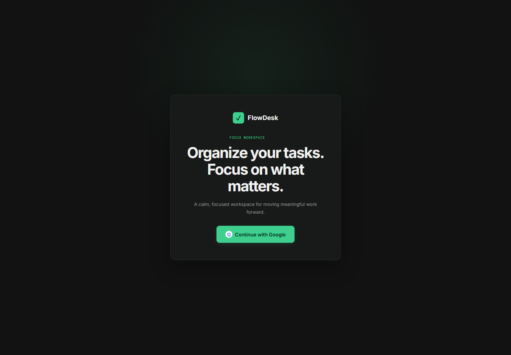
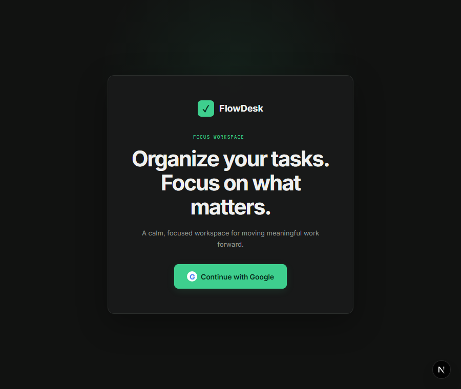

# FlowDesk

FlowDesk is a polished, responsive task-management dashboard built with Next.js and TypeScript. Its interface takes visual inspiration from modern developer tools, combining muted surfaces, subtle borders, and a focused green accent.

## Demo

### Desktop landing page



### Compact landing page



## Features

- Create, edit, complete, restore, and delete tasks
- Add descriptions, priorities, due dates, projects, and tags
- Search task titles, descriptions, projects, and tags
- Interpret natural-language searches such as `show urgent tasks due next week`
- Convert interpreted search intent into removable filter chips
- Recent searches and `/` or `Ctrl/Cmd + K` keyboard shortcuts
- Filter tasks by status, priority, and project
- Sort by creation date, due date, priority, or title
- Dedicated Today, Upcoming, and Completed views
- Project creation and management
- Dashboard statistics and completion progress
- Dark and light themes
- Responsive desktop, tablet, and mobile layouts
- Collapsible desktop sidebar and mobile navigation drawer
- Confirmation dialogs, empty states, and toast notifications
- Authenticated, cross-device task and project persistence through Supabase
- In-app reminders and optional standards-based browser push notifications
- Exact-email user connections, task assignment, and reviewed/approved workflows
- Responsive Work Board with collaboration filters, secure drag-and-drop, review notes, and activity history
- Keyboard focus states and reduced-motion support

## Tech Stack

- [Next.js](https://nextjs.org/) App Router
- [React](https://react.dev/)
- [TypeScript](https://www.typescriptlang.org/)
- [Lucide React](https://lucide.dev/) icons
- [Supabase](https://supabase.com/) authentication and PostgreSQL persistence
- Custom responsive CSS
- npm

## Getting Started

### Prerequisites

- Node.js 18.18 or newer
- npm
- A Supabase project with the repository migrations applied

### Installation

```bash
npm install
```

### Development

```bash
npm run dev
```

Open [http://localhost:3000](http://localhost:3000) in your browser.

### Production Build

```bash
npm run build
npm start
```

### Supabase OAuth on Vercel

In **Supabase Dashboard → Authentication → URL Configuration**, set:

- **Site URL:** your production Vercel URL, for example `https://flowdesk.example.com`
- **Redirect URLs:** `https://flowdesk.example.com/auth/callback`
- For Vercel preview deployments, optionally add `https://*-<team-or-account-slug>.vercel.app/**`
- Keep `http://localhost:3000/auth/callback` as an additional redirect only for local development

The application builds the OAuth callback from the domain currently open in the browser. The callback also honors Vercel's forwarded host and protocol headers, so production login returns to the same deployed domain.

### Browser push notifications

Apply all Supabase migrations, then configure these variables locally and in Vercel:

```bash
NEXT_PUBLIC_VAPID_PUBLIC_KEY=
VAPID_PRIVATE_KEY=
VAPID_SUBJECT=mailto:admin@example.com
SUPABASE_SERVICE_ROLE_KEY=
CRON_SECRET=
```

Generate the VAPID key pair with `npx web-push generate-vapid-keys`. Only the public key may be exposed to the browser. The service-role key, private VAPID key, and cron secret must remain server-only.

The GitHub Actions workflow `.github/workflows/notification-processor.yml` calls `/api/notifications/process` every five minutes with `CRON_SECRET` in the authorization header. This keeps the deployment compatible with Vercel Hobby, whose cron jobs can run only once per day. Add repository Actions secrets named `FLOWDESK_URL` (your production origin, such as `https://flowdesk.example.com`) and `CRON_SECRET` (the same value configured in Vercel). The processor uses `due_at` timestamps, sends each eligible reminder to every registered device, and records each task/reminder/subscription delivery to prevent duplicates.

Push requires HTTPS outside localhost. Browser and operating-system support varies; iOS Web Push generally requires an installed Home Screen web app and a supported iOS version. Browser permission must be granted through the Settings action.

### Linting

```bash
npm run lint
```

## Project Structure

```text
src/
├── app/
│   ├── globals.css       # Theme tokens, layout, components, and responsive styles
│   ├── layout.tsx        # Root layout and metadata
│   └── page.tsx          # Application entry point
├── components/
│   └── TodoApp.tsx       # Dashboard views and task-management interactions
└── lib/
    ├── data.ts           # Initial sample projects and tasks
    └── types.ts          # Shared task, project, priority, and view types
```

## Data Persistence

Authenticated projects and tasks are stored in Supabase and protected by row-level security. Workspace data persists across refreshes and devices for the signed-in account.

Device-specific preferences such as the selected theme and recent searches remain in browser `localStorage`.

## Collaboration workflow

Apply `20260902000500_add_user_connections_and_task_workflow.sql`, `20260903000100_secure_profile_email_sync.sql`, `20260903000200_collaborative_board_workflow.sql`, and `20260904000100_add_task_comments.sql` before deploying the collaboration UI. Users connect from the People tab by entering another FlowDesk user’s exact email address. The recipient must accept the request before tasks can be assigned.

Assigned tasks follow this workflow:

```text
Assigned → Working → Reviewed → Approved
```

The assignee starts work and submits it for review. The task owner can approve reviewed work or return it to Working with a review note. Approval marks the task complete inside the database workflow function. Reassignment and unassignment are owner-only, reset the workflow to Assigned, and accept only current connections; removing a connection does not invalidate work already assigned.

The Work Board is another view of the same task rows used by the normal task lists. It provides All collaborative work, Assigned by me, and Assigned to me views; person/project filters; due-state indicators; a hide-approved control; desktop Kanban columns; and mobile stage tabs. Drag-and-drop calls the same constrained RPCs as the visible workflow buttons and rolls back when the database rejects a transition.

`task_activity` stores trusted assignment and stage events. Its actor is derived from `auth.uid()` by database triggers, and RLS limits history to the task’s current owner or assignee. Supabase Realtime refreshes task and connection data while both participants have FlowDesk open. Scheduled due reminders continue to use the existing notification processor; collaboration-event push notifications are intentionally deferred in the lighter implementation.

Task owners and current assignees can also exchange lightweight comments from the Work Board detail drawer. Comments use a secure database function that derives the author from `auth.uid()`; direct client inserts are disabled, and participant-only RLS protects the discussion. New comments refresh live for participants who have the board open.

## Optional AI Search

Natural-language search works locally without configuration. To enhance intent parsing with OpenAI, add a server-side environment variable:

```bash
OPENAI_API_KEY=your_api_key
```

An optional model override is also supported:

```bash
OPENAI_SEARCH_MODEL=gpt-5.6-sol
```

API keys are read only by the server route and are never included in client-side code. If the service is unavailable, times out, or returns malformed data, FlowDesk automatically uses its local intent parser.

## Responsive Design

FlowDesk supports:

- Mobile layouts from approximately 320px
- Tablet layouts
- Standard desktop layouts
- Wide displays at 1440px and above

Task rows automatically become mobile-friendly cards, while the desktop sidebar changes into a slide-out navigation drawer.

## Accessibility

The application includes semantic controls, visible focus indicators, accessible labels, keyboard-friendly dialogs, comfortable mobile touch targets, and reduced-motion support.

## Scripts

| Command | Description |
| --- | --- |
| `npm run dev` | Start the local development server |
| `npm run build` | Create an optimized production build |
| `npm start` | Serve the production build |
| `npm run lint` | Run ESLint checks |

## License

This project is intended for personal and portfolio use.
